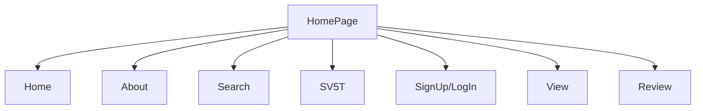

## Tin học hóa - Mùa hè xanh 2021 - Trường ĐH Khoa học tự nhiên TP.HCM

## Hướng dẫn chạy trên local bằng npm :
- Bước 1 : tiến hành cái đặt npm
  ```php
  install npm 
  ```
- Bước 2 : sau khi đã install, chạy chương trình bằng lệnh :
    ```php
  npm start
    ```
- Bước 3 : click vào url : http://localhost:3000 để chạy trên local

## Hướng dẫn deloy trên netlify bằng cách kéo thả :
- Bước 1 : trên terminal, tạo file build : 
   ```php
  npm run build
  ```
- Bước 2 : mở netlify và đăng nhập netlify trên trình duyệt 
- Bước 3 : kéo thả file build vừa được tạo ra vào mục upload trên netlify để tiến hành deloy project

## Cấu trúc dự án R2US : 
#### I. Giao diện chức năng khi user sử dụng :

#### II. Chức năng của chương trình  :

|  Ten chuc nang| Chuc nang thuc hien chinh       |    
|---------------|---------------------------------|
|   Home        | Trang chủ của website           |    
|   About       | Thông tin bên lề về website     |   
|   Search      | Tìm kiếm thông tin về tài liệu  |     
|   SV5T        | Thông tin về sinh viên 5 tốt    |   
|   Sign Up     | Đăng kí tài khoản để sử dụng dịch vụ web |    
|   Log In      | Đăng nhập tài khoản             |     
|   View        |   xem thông tin về tài liệu     |
|   View        |   xem thông tin về tài liệu     |    
|   Review      |   Review về môn học             |    
#### III. Cấu trúc thư mục chương trình  :
chưa hoàn thành


